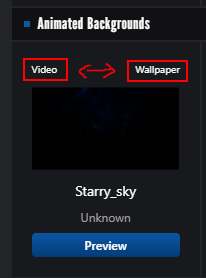

# Steam Styling Artwork Showcase

Links:  
https://steam.design/ <!-- Used for Turning the image/video into steam artwork layouts -->  
https://www.steamcardexchange.net/index.php <!-- Used for getting the background artwork image/video links -->  
https://giphy.com/ <!-- Turning the image/video into gifs with choices of adding some pretty neat texts animation and exporting it out -->  
https://ezgif.com/ <!-- Could also use this to do so both are fine -->  
https://store.steampowered.com/ <!-- Official Steam Site -->

## Getting your steam background assets
1) Go to https://www.steamcardexchange.net/index.php and search for the game that has the background that you want to work with.
2) Scroll down to Animated Backgrounds section and find the background.
3) Choose if you want to work with video(animated background) or wallpaper and open it.  
   
4) Now a new tab should open, right click on the new page and 'copy video/image address'
5) Go to https://steam.design/ and paste your video/image address to 'Paste a background url here'
6) Now click 'Download ZIP'
7) Now unzip the file
<br>
<br>

## Animating Your Artwork Showcase
Now we have to turn the unzipped files into gifs. There are many many ways to do so but ill list 2 simple ways to do it.

#### Using Giphy (1st because it has some pretty cool gif effects)
1) Go to https://giphy.com/
2) Login to it
3) Press 'Create' button in their home page
4) Choose Gif format
5) Choose the unzipped file you want to work with. Usually its middle + right top or just featured.
6) Do whatever edits you want to it, then upload it.
7) After uploading it should be turned to gif files, right click on the gif and save it.

#### Using Ezgif (Good for video to gif)
1) Go to https://ezgif.com/video-to-gif
2) Upload your unzipped file you want to work with. Usually its middle + right top or just featured.
3) Do whatever edits you want to it, then convert it to gif
<br>
<br>

## Uploading Artwork
1) Go to https://store.steampowered.com/
2) Login to it
3) Repeat below steps for multiple images that you want to upload
4) Go to your profile - artwork - upload artwork - not game specific
5) if you want to hide your artwork title so it wont be shown below artwork when in your profile use this as title
```
⁣
```
or this
```
­
```
5) Now upload your gif
6) In google chrome press F12 to open 'inspect'
7) Click on 'Console'
8) Copy and Paste this command in
```
document.getElementsByName("image_width")[0].value = 999999;
document.getElementsByName("image_height")[0].value = 1;
```
9) Rights and ownership - I certify that I created this artwork
10) Now press save and continue
<br>
<br>

## Applying the Artwork
Artwork showcase would need to be purchased from point shop and you would need to be at a specific steam level to unlock it.
1) Go to your profile - Edit Profile - Featured Showcase - Choose artwork showcase(could rearrange to whatever)
2) Now choose the gifs you uploaded


